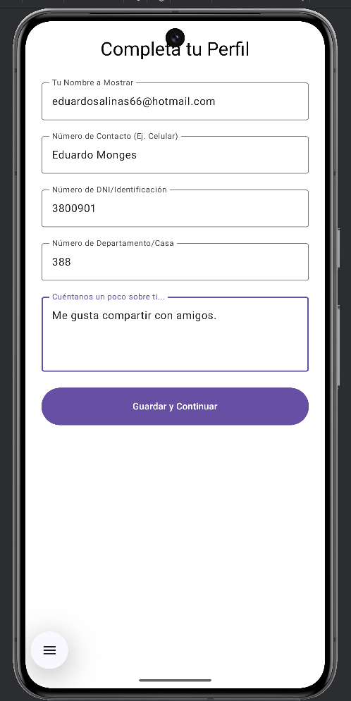

Documentación del Proyecto: Tablón Comunitario
================================================

Resumen: Objetivo de la Aplicación y Funciones más Relevantes

    Objetivo de la Aplicación:
        El "Tablón Comunitario" es una aplicación móvil diseñada para facilitar la comunicación y la interacción entre los miembros de una comunidad 
        (ej. un vecindario, un edificio, un grupo de interés). Permite a los usuarios publicar, visualizar avisos y anuncios importantes, así como interactuar
        con el contenido a través de comentarios y la visualización de perfiles de otros miembros.

    Funciones más Relevantes:

       Autenticación de Usuarios:
          - Registro: Permite a nuevos usuarios crear una cuenta con email y contraseña, incluyendo la opción de configurar su perfil completo desde el inicio 
          (nombre, número de contacto, documento de identidad, número de departamento, información "Acerca de mí").
          - Inicio de Sesión: Permite a usuarios existentes acceder a la aplicación.
          - Gestión de Perfiles de Usuario:
             * Creación de Perfil Inicial: Configuración guiada del perfil después del registro.
             * Edición de Perfil: Permite a los usuarios actualizar sus datos personales y su foto de perfil. 
             Campos sensibles como el nombre y el documento de identidad son de solo lectura una vez establecidos, mientras que otros datos son editables. 
             * Visualización del Perfil Propio: Muestra la información personal y los anuncios publicados por el usuario.
             * Previsualización de Perfil de Otros Usuarios: Al hacer clic en un autor de comentario, se puede ver una vista rápida de su perfil público.

       Gestión de Anuncios (CRUD):
          - Creación de Anuncios: Los usuarios autenticados pueden publicar nuevos anuncios con título, descripción y, opcionalmente, una imagen (no implementado).
          - Visualización de Anuncios: Muestra un listado principal de todos los anuncios disponibles, con funcionalidad de búsqueda.
          - Detalles del Anuncio: Permite ver la información completa de un anuncio, incluyendo la descripción completa y la imagen en grande.
          - Edición y Eliminación de Anuncios: El autor de un anuncio puede editarlo o eliminarlo, siempre y cuando el anuncio no tenga comentarios. Esta regla de negocio se 
          aplica en la interfaz de usuario.
    
       Interacción y Comunidad:
          - Comentarios: Los usuarios pueden ver y añadir comentarios a los anuncios, fomentando la interacción comunitaria.
    
       Navegación y Arquitectura:
          - Navegación Consolidada: Utiliza Jetpack Compose Navigation con una única MainActivity como NavHost central para gestionar todas las transiciones de pantalla.
          - Patrón MVVM (Model-View-ViewModel): Toda la lógica de negocio y el manejo de estados de la UI residen en ViewModels dedicados para cada pantalla, exponiendo el 
          estado a través de UiStates y manejando eventos.
          - Patrón Repositorio y Fuentes de Datos: Abstracción de la capa de datos. Los datos estructurados se almacenan localmente en una base de datos SQLite (a través de Room)
          y las imágenes se gestionan con Firebase Storage.

Diagrama: Relación entre los componentes de la aplicación.

Manual de usuario.

1. Inicio de la Aplicación:

1.1. Al abrir la aplicación por primera vez o si no has iniciado sesión, se te presentará la pantalla de Inicio de Sesión / Registro.

1.2. Si ya iniciaste sesión previamente, la aplicación te llevará directamente a la Pantalla Principal de Anuncios.

2. Registro de Usuario:

2.1. En la pantalla de Inicio de Sesión / Registro, ingresa tu dirección de correo electrónico y una contraseña (de al menos 6 caracteres). Y haz clic en "Registrarse".

2.2. Si el registro es exitoso, se te redirigirá a la pantalla "Completa tu Perfil".

2.3. En esta pantalla, ingresa tu "Nombre a Mostrar", "Número de Contacto", "Número de DNI", "Número de Departamento/Casa" y "Acerca de mí". 
Haz clic en "Guardar y Continuar" para finalizar la configuración inicial de tu perfil.
(Nota: La selección de foto de perfil en esta pantalla no está implementada en esta versión.)

3. Inicio de Sesión:

3.1. En la pantalla de Inicio de Sesión / Registro, ingresa tu correo electrónico y contraseña registrados. Y haz clic en "Iniciar Sesión".

3.2. Serás redirigido a la Pantalla Principal de Anuncios.

4. Pantalla Principal de Anuncios:

4.1. Aquí verás un listado de todos los anuncios publicados por los miembros de la comunidad. 
Buscar Anuncios: Utiliza la barra de búsqueda en la parte superior para filtrar anuncios por título y autor.

4.2. Añadir Nuevo Anuncio: Haz clic en el botón flotante + en la esquina inferior derecha para crear una nueva publicación.

5. Mi Perfil:

5.1. Desde la Pantalla Principal de Anuncios, haz clic en "Mi Perfil" en la cabecera.
Verás tu información de perfil y una lista de los anuncios que has publicado.

5.2. Editar Perfil: Haz clic en "EDITAR PERFIL" para modificar tu número de contacto, número de departamento, 
o tu sección "Acerca de mí". Tu nombre a mostrar y DNI no son editables.
(Nota: La selección/cambio de foto de perfil en esta pantalla no está implementada en esta versión.)

6. Detalles del Anuncio y Comentarios:

6.1. Haz clic en cualquier anuncio en la lista principal para ver sus detalles.
Comentarios: Verás una sección de comentarios al final. Puedes escribir en el campo de texto y hacer clic en el botón de enviar 
para añadir tu comentario.

6.2. Eliminar Anuncio: Si eres el autor del anuncio y no tiene comentarios, verás un botón "ELIMINAR". Al hacer clic, se eliminara dicho anuncio.

Restricción de Edición/Eliminación: Los anuncios que ya tienen comentarios no pueden ser editados ni eliminados.

7. Ver Perfil de Otro Usuario:

7.1. En la pantalla de Detalles del Anuncio, haz clic en el nombre o la foto de perfil de un autor de comentario.
Se abrirá una vista previa con su información pública (nombre, contacto, departamento, y "Acerca de").

9. Navegación:

Utiliza el botón de retroceso <-- en la barra superior de cada pantalla para volver a la pantalla anterior.
El botón de retroceso físico de tu dispositivo también funcionará como se espera.

